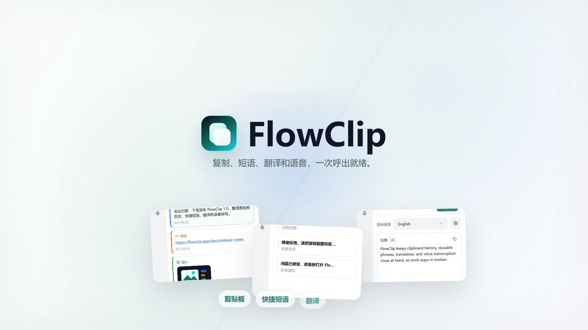
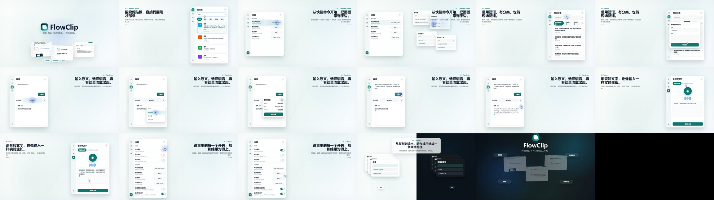

# FlowClip

FlowClip is a Windows tray productivity app for clipboard history, reusable phrases, translation, and voice transcription. It keeps everyday text workflows in one focused desktop panel.



## Promo Video

The generated launch-style promo video is included in this repository:

[Watch the FlowClip promo video](media/flowclip-promo-16x9.mp4)

Review/contact image:



## Features

- Clipboard history with search, filtering, pinning, recopy, and sensitive-content safeguards.
- Reusable phrases grouped by category, with variable support for dates, time, and clipboard content.
- Translation through Google free endpoint or OpenAI-compatible AI providers such as DeepSeek.
- Voice transcription through configurable ASR providers such as SiliconFlow SenseVoice.
- Global shortcut floating panels for clipboard, phrases, translation, and voice workflows.
- Tray-first behavior with dark mode, always-on-top, startup, storage location, and diagnostics support.

## Development

```bash
npm install
npm run dev
```

Run checks:

```bash
npm run typecheck
npm run smoke
```

Build the installer:

```bash
npm run dist
```

`npm run dist` generates the PDF user guide, builds the Electron app, and writes installer artifacts to `release/`.

## License

MIT
