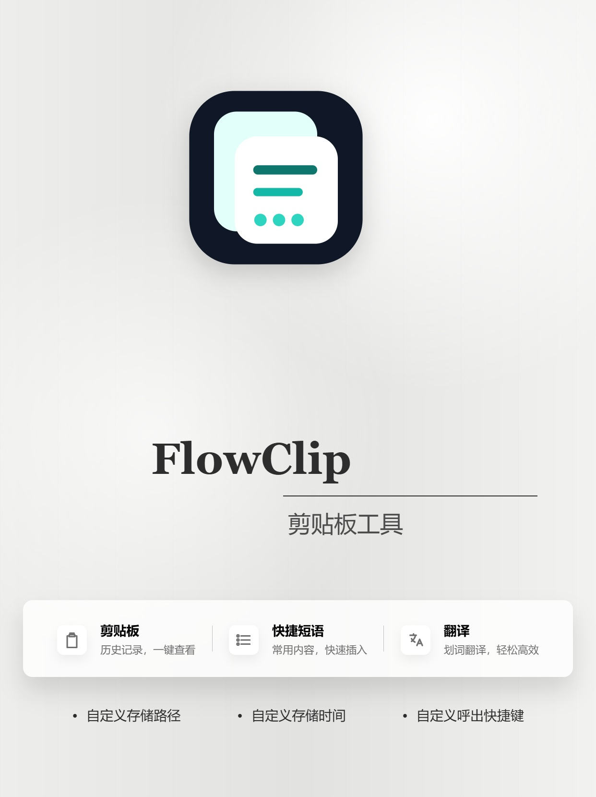
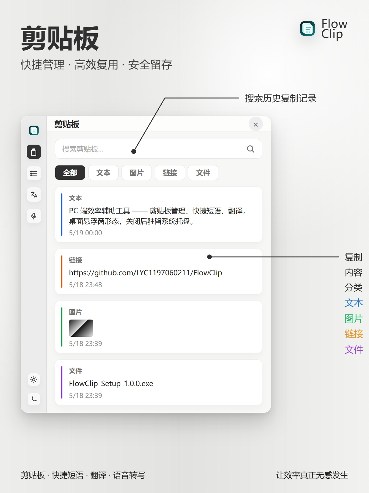
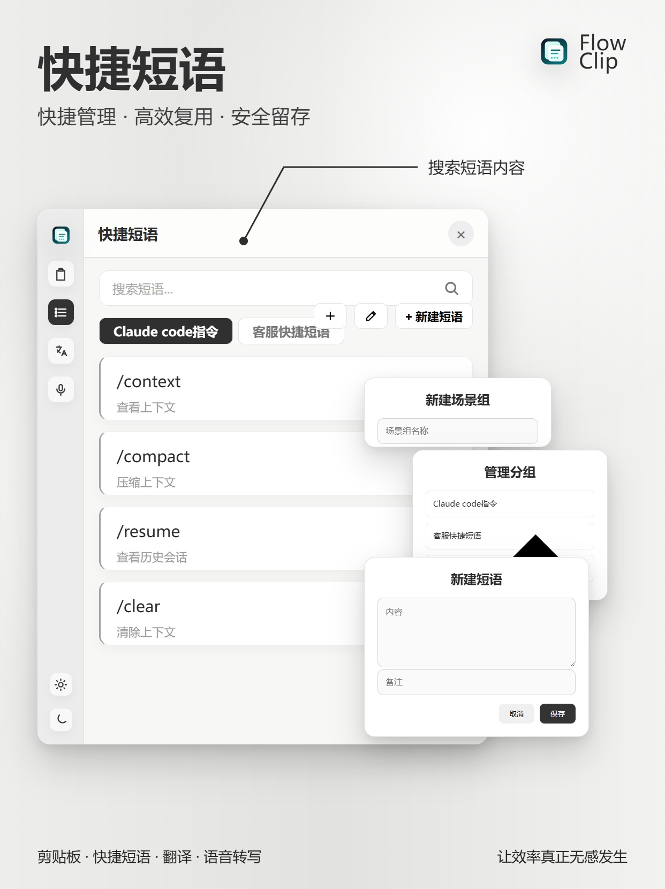
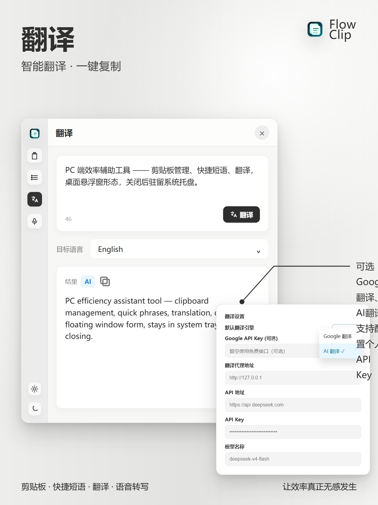
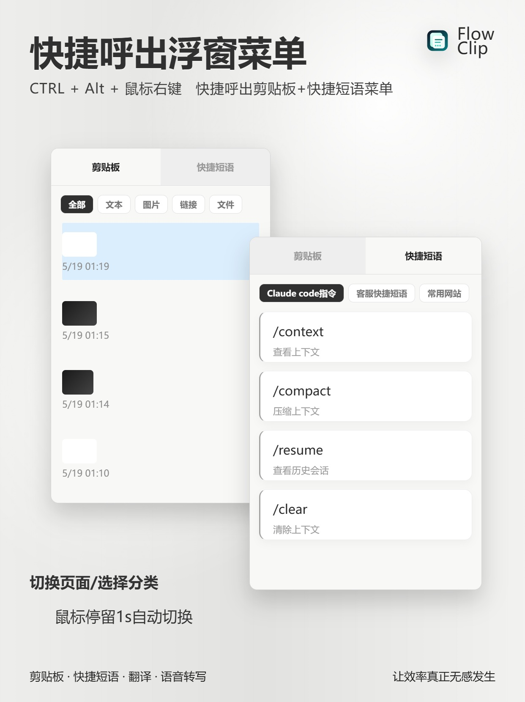
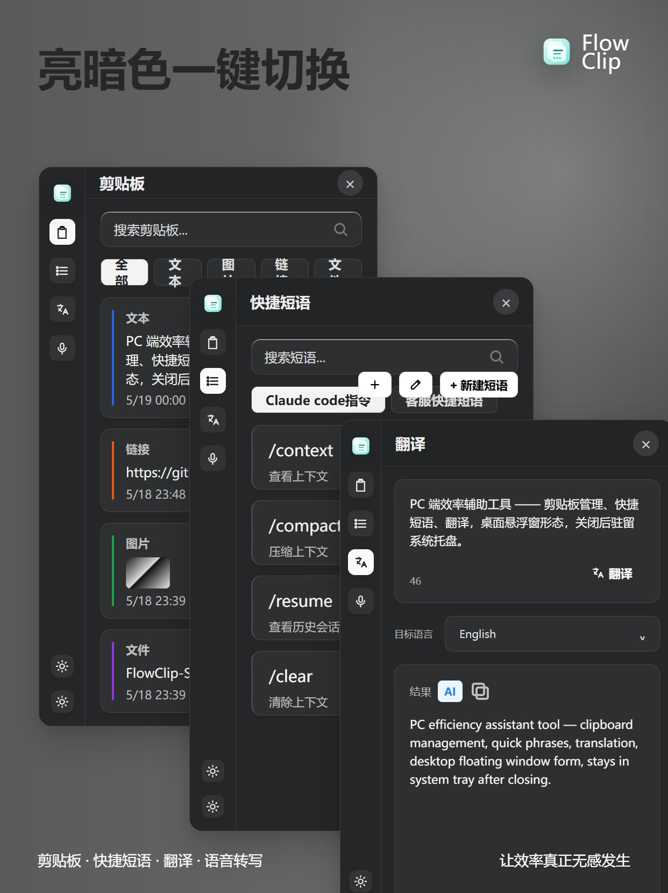

# FlowClip

FlowClip 是一个面向 Windows 的托盘效率工具，把剪贴板历史、快捷短语、翻译和语音转写放进同一个轻量悬浮面板里。它适合需要频繁复制粘贴、复用固定话术、处理多语言文本、快速调用桌面工具的人。



## 下载安装

从 GitHub Releases 下载最新安装包：

[下载 FlowClip Windows 安装包](https://github.com/LYC1197060211/FlowClip/releases/latest)

当前版本：`v1.0.0`

## 主要能力

- 剪贴板历史：自动记录文本、图片、链接、文件，支持搜索、分类筛选、置顶、复制回剪贴板。
- 快捷短语：按场景组管理常用内容，支持快速复制、导入导出，以及日期、时间、剪贴板等变量。
- 翻译：支持 Google 免费接口和 OpenAI-compatible AI 翻译，可配置 DeepSeek、自定义 API 地址、代理和模型。
- 语音转写：支持可配置 ASR 服务，例如 SiliconFlow SenseVoice，适合把语音内容快速转成文字。
- 快捷呼出：全局快捷键唤起剪贴板、快捷短语和语音浮窗，减少来回切窗口。
- 托盘常驻：关闭窗口后驻留系统托盘，支持开机自启、窗口置顶、深色模式和自定义存储路径。
- 隐私保护：疑似密码、Token、API Key 等敏感内容默认不保存到剪贴板历史。

## 产品预览

| 剪贴板 | 快捷短语 |
| --- | --- |
|  |  |

| 翻译 | 快捷呼出浮窗 |
| --- | --- |
|  |  |

| 亮暗色切换 | 宣发视频 |
| --- | --- |
|  | [观看 FlowClip 宣发视频](media/flowclip-promo-16x9.mp4) |

## 适用场景

- 开发者：复用命令、Prompt、上下文片段、调试文本和链接。
- 客服/运营：管理常用话术，一键复制并快速粘贴到当前窗口。
- 内容工作者：整理剪贴板材料，快速翻译、改写和转写语音内容。
- 日常办公：管理临时文本、文件路径、截图和常用回复。

## 技术栈

- Electron + electron-vite
- React + TypeScript
- Tailwind CSS
- Zustand
- lucide-react

## 本地开发

```bash
npm install
npm run dev
```

运行检查：

```bash
npm run typecheck
```

构建 Windows 安装包：

```bash
npm run dist
```

`npm run dist` 会生成应用图标、PDF 用户手册、Electron 构建产物和 Windows NSIS 安装包，输出目录为 `release/`。

## 文档

- [使用说明](docs/FlowClip-使用说明.md)
- [发布说明](docs/FlowClip-发布说明.md)

## License

MIT
